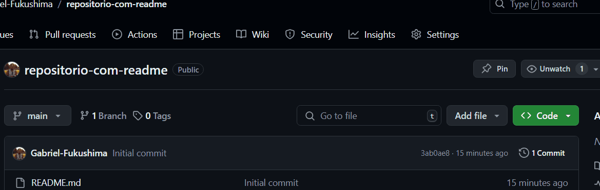

# Projeto com README
Um projeto de teste com um arquivo README 👾

[]

## Tecnologias utilizadas
- HTML
- CSS
- JS

## Como utilizar 
Clone pro o projeto

1 - git clone 

git clone "<"url">"

2 - Acesse a pasta do projeto

cd repositorio-com-readme

